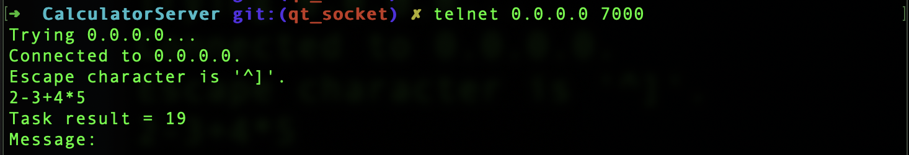
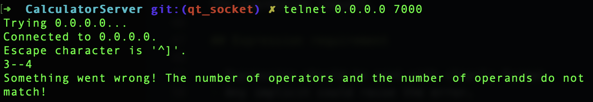

# CalculatorServer

## Requirement

- Qt

NOTE: This solution has been test on:

- macOS BigSug 11.5 with Qt 5.15.2 (Clang 11.0 (Apple), 64 bit)

## Installing and running

- Download install Qt, link <https://download.qt.io/archive/online_installers/4.1/>
- Open project from file _CalculatorServer.pro_
- Build project in the __release__ mode
- Open build folder in terminal (Let check your IDE's config: Projects tab > Build & Run > [Kit selected] > Build > General > Build directory)
- Start app with command:

```sh
 ./CalculatorServer [port]
```

Example:

```sh
 ./CalculatorServer 7000
```

## Using

We can connect by _telnet_ or _netcat_ to send expression.

Example: (for localhost)

```sh
 telnet 0.0.0.0 7000
```

Or,

```sh
 telnet 127.0.0.1 7000
```

The server will response the result or error message. The connection will be kept to get more the expression request.

## Expression requirement

- Expression should be sent with clearly format.
- Any implicit could raise the error.
 Example:

 ```sh
 3 + 4 + 5      // valid
 3 * (4 + 5)    // valid
 3 (4 + 5)      // invalid: missing multiple (*) operator
 3 -- 4         // invalid: double minus, should be: 3 + 4
 ```



